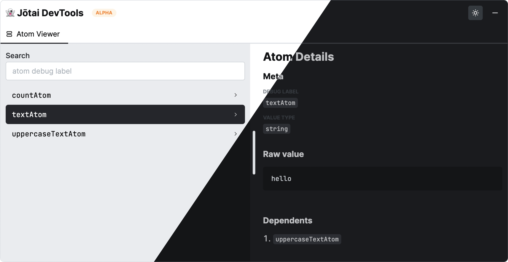

# Jotai DevTools

## Features

- Debug 🐞 atom values with ease
- Out-of-the-box 🔌 support for async/suspendible atoms
- Built-in Dark mode 🌗
- ✅ Supports custom `store`
- ✅ Works with provider-less mode
- ✅ Works with Next.js
- ✅ Supports custom `nonce` for CSP
- ✅ Hides private atoms with ability to configure (requires Jotai `>=2.0.3`)

## Preview

<p>
    <a href="https://www.npmjs.com/package/jotai-devtools">
      
  </a>
</p>

## Prerequisites

- Jotai version `>=1.11.0` (highly recommended to use `2.x.x`)
- React version `>=17.0.0`

## Setup

```sh
# yarn
yarn add jotai-devtools

# npm
npm install jotai-devtools --save
```

## UI DevTools

### Babel plugin setup - (Optional but highly recommended)

Use Jotai babel plugins for optimal experience. Full guide is available on
[jotai.org](https://jotai.org/docs/tools/babel)

Eg.

```ts
{
  "plugins": [
    // Enables hot reload for atoms
    "jotai/babel/plugin-react-refresh",
    // Automatically adds debug labels to the atoms
    "jotai/babel/plugin-debug-label"
  ]
}
```

### Next JS setup

Enable `transpilePackages` for CSS to be imported correctly.

```ts
// next.config.ts

const nextConfig = {
  // Learn more here - https://nextjs.org/docs/advanced-features/compiler#module-transpilation
  // Required for font css to be imported correctly 👇
  transpilePackages: ['jotai-devtools'],
};

module.exports = nextConfig;
```

### Provider-less

```tsx
import { DevTools } from 'jotai-devtools';

const App = () => {
  return (
    <>
      <DevTools />
      {/* your app */}
    </>
  );
};
```

### With Provider

```tsx
import { createStore } from 'jotai';
import { DevTools } from 'jotai-devtools';

const customStore = createStore();

const App = () => {
  return (
    <Provider store={customStore}>
      <DevTools store={customStore} />
      {/* your app */}
    </Provider>
  );
};
```

### Available props

```ts
type DevToolsProps = {
  // defaults to false
  isInitialOpen?: boolean;
  // pass a custom store
  store?: Store;
  // Defaults to light
  theme?: 'dark' | 'light';
  // Custom nonce to allowlist jotai-devtools specific inline styles via CSP
  nonce?: string;
  options?: {
    // Private atoms are used internally in atoms like `atomWithStorage` or `atomWithLocation`, etc. to manage state.
    // Defaults to `false`
    shouldShowPrivateAtoms?: boolean;
  };
};
```

## Hooks

Detailed documentation is available on
[https://jotai.org/docs/api/devtools](https://jotai.org/docs/api/devtools)

```tsx
import {
  useAtomsSnapshot,
  useGotoAtomsSnapshot,
  useAtomsDebugValue,
  // Redux devtool hooks
  useAtomDevtools,
  useAtomsDevtools,
} from 'jotai-devtools';
```

## Migration guides

### Migrate Jotai to V2

Find the official migration guide on
[jotai.org](https://jotai.org/docs/guides/migrating-to-v2-api)

### Migrate `jotai/react/devtools` to `jotai-devtools`

1. Install this package

   ```sh
   # npm
   npm install jotai-devtools --save

   # yarn
   yarn add jotai-devtools
   ```

2. Update imports from `jotai/react/devtools` to `jotai-devtools`
   ```diff
   import {
    useAtomsSnapshot,
    useGotoAtomsSnapshot,
    useAtomsDebugValue,
    // Redux devtool integration hooks
    useAtomDevtools,
    useAtomsDevtools,
   - } from 'jotai/react/devtools';
   + } from 'jotai-devtools';
   ```

### Other announcements

✨ [First announcement](https://twitter.com/dai_shi/status/1611717249471246338)
